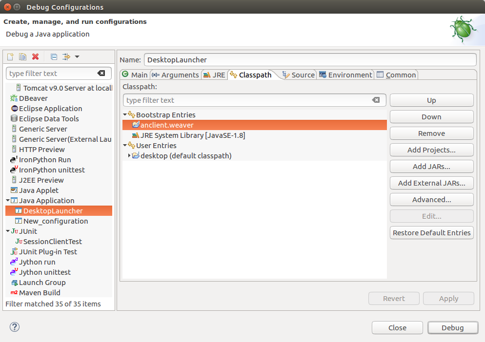

Start from sources
==================

Clone project::

    git clone https://github.com/odys-z/wordnet-weaver.git wnw

Import wn-server
----------------

In Eclipse (tested on Oxygen)::

    import -> existing maven project -> browse to file://wnw/wn-serv

Import anclient.weaver
----------------------

In Eclipse (tested on Oxygen)::

    import -> existing maven project -> browse to file://wnw/lib/anclient

Import normod
-------------

The normod is a `libGDX <https://libgdx.badlogicgames.com/>`_ gradle project with
sub-prorjects `created with gdx-setup <https://libgdx.badlogicgames.com/documentation/gettingstarted/Creating%20Projects.html>`_.

The default gradle project is been set using gradle wrapper's local mode. If your
need a newer version, or using gradle online mode, change this file::

    wnw/normode/gradle/wrapper/gradle-wrapper.properties

comment out line 5 and use this line::

    distributionUrl=https\://services.gradle.org/distributions/gradle-5.4.1-bin.zip

If using local mode, the gradle binary zip must been downloaded and saved locally,
and the file path needing to be changed in configure file.

Gradle.bin.zip can be `download from gradle home page <https://gradle.org/releases/>`_.

To import normod, in Eclipse::

    import -> existing gradle project -> browse to wnw/normode

Note: According to the author's experience, you better run desktop project in
Eclipse and run Android project from Android Studio.

*Follow these steps to resolve dependencies.*

1. Install Universal Tween Engine Locally
_________________________________________

.. attention:: Tween Engine will be dropped in the near future.

`Universal Tween Engine <https://github.com/AurelienRibon/universal-tween-engine>`_
can be installed to local maven repository. The build.gradle has a default task
to install into local manven.

.. seealso:: :ref:`install on Ubuntu <install-tween-ubuntu>`

2. Install Anclient.weaver
__________________________

In sub-folder lib/anclient::

    mvn install

If Eclipse still reporting error of not found class from io.oz.jwi.*, try fix
project's build path - add anclient.weaver to core project build path in Eclipse.

.. seealso:: :ref:`Troubleshooting <sol-install-wnw-client>`

3. About Install Ashley Locally (optional)
__________________________________________

The normal project depends on Ashley and `Universal-tween-engine <https://github.com/AurelienRibon/universal-tween-engine>`_.
Both have some problem for newest GDX version to depends on. And have to be installed
in local maven repository.

To install Ashley locally, see `Ashely issue #279 <https://github.com/libgdx/ashley/pull/279>`_.

To install Universal-tween-engine, run it's gradle task.

If Eclipse doesn't recognize dependency class, this may help::

    right click build.gradle -> gradle -> refresh project

4. Add gradle mirror repository as defualt by gdx-setup (optional)
__________________________________________________________________

The default gdx-setup doesn't use any mirror repository. The experimenting version
may be helpful at `odys-z/hello <https://github.com/odys-z/hello/tree/master/GDX/gdx-setup>`_.

Troubleshootings
----------------

Could not find com.android.tools.build:gradle
_____________________________________________

Error::

    FAILURE: Build failed with an exception.

    * What went wrong:
    A problem occurred configuring root project 'normode'.
    > Could not resolve all artifacts for configuration ':classpath'.
    > Could not find com.android.tools.build:gradle:7.0.0-beta05.
     Searched in the following locations:
       - file:/home/user/.m2/repository/com/android/tools/build/gradle/7.0.0-beta05/gradle-7.0.0-beta05.pom
       - https://repo.maven.apache.org/maven2/com/android/tools/build/gradle/7.0.0-beta05/gradle-7.0.0-beta05.pom
       - https://plugins.gradle.org/m2/com/android/tools/build/gradle/7.0.0-beta05/gradle-7.0.0-beta05.pom
       - https://oss.sonatype.org/content/repositories/snapshots/com/android/tools/build/gradle/7.0.0-beta05/gradle-7.0.0-beta05.pom
       - https://jcenter.bintray.com/com/android/tools/build/gradle/7.0.0-beta05/gradle-7.0.0-beta05.pom
       - https://dl.google.com/dl/android/maven2/com/android/tools/build/gradle/7.0.0-beta05/gradle-7.0.0-beta05.pom
     Required by:
         project :

Solution:

Search `manven.google <https://maven.google.com/web/index.html?q=gradle#com.android.tools.build:gradle>`_
or `maven repo <https://mvnrepository.com/artifact/com.android.tools.build/gradle?repo=google>`_
for available gradle version, in normod/build.gradle:

.. code-block:: groovy

    dependencies {
        classpath 'org.wisepersist:gwt-gradle-plugin:1.0.9'
        classpath 'com.android.tools.build:gradle:7.0.0-alpha08'
        ...
    }
..

**Note:** gradle 7 needs JDK 11.

To change gradle jdk version, in gradle.properties::

    org.gradle.java.home=/home/ody/progs/jdk-15.0.2

Gradle version not supported
_____________________________

Error::

	FAILURE: Build failed with an exception.

	* Where:
	Build file '/home/user/git/wnw/normode/build.gradle' line: 62

	* What went wrong:
	A problem occurred evaluating root project 'normode'.
	> Failed to apply plugin 'com.android.internal.version-check'.
	> Minimum supported Gradle version is 6.8.2. Current version is 6.6.1. If using the gradle wrapper, try editing the distributionUrl in /home/ody/git/wnw/normode/gradle/wrapper/gradle-wrapper.properties to gradle-6.8.2-all.zip

Solution:

Download at `Gradle Release <https://gradle.org/releases/>`_.

Can not resolve Ashley 1.7.0
____________________________

.. attention:: This will be changed to use Ashley 1.7.4.
    see `Ashley issue #278 <https://github.com/libgdx/ashley/issues/278>`_
    & `#279 <https://github.com/libgdx/ashley/pull/279>`_

Error::

    The container 'Project and External Dependencies' references non existing library
    '/home/ody/.gradle/caches/modules-2/files-2.1/com.badlogicgames.ashley/ashley/1.7.0/a7c4083c0a42027a3c03ba7ccecef6cbe1c5f0a4/ashley-1.7.0.jar'

Cause:

Wordnet-weaver/normal module depends on Ashley v1.7.0. The desktop(Eclipse) project
depend it locally.

Install Ashley 1.7.0 to local maven::

    gradlew install

Class of Weaver not Found
_________________________

Error:

When running desktop, report error message like::

    Exception in thread "LWJGL Application" com.badlogic.gdx.utils.GdxRuntimeException: java.lang.NoClassDefFoundError: io/oz/wnw/my/ISettings
    at com.badlogic.gdx.backends.lwjgl.LwjglApplication$1.run(LwjglApplication.java:135)
    Caused by: java.lang.NoClassDefFoundError: io/oz/wnw/my/ISettings
    ...

Cause:

The normode/core gradle sub-project depends on another maven project, anclient.weaver.
The desktop application can't find it's class in run time environment.

.. _sol-install-wnw-client:

Solution:

In core/gradle.build, add compile dependency after applied Java plugin. (
`Otherwise the compile command will failed <https://stackoverflow.com/questions/23796404/could-not-find-method-compile-for-arguments-gradle>`_.)

.. code-block:: groovy

    dependencies {
	    compile 'io.github.odys-z:anclient.weaver:0.0.1-SNAPSHOT'
    }
..

Update anclient.weaver dependency or install it to local repository. In sub-folder
wn-serv::

    mvn install

then have normal/gradle.build use mavenLocal:

.. code-block:: groovy

    repositories {
        mavenLocal()
        ...
    }
..

Now the gradlew run task should start the desktop application.

When using Eclipse to debug, the depending project must been added to runtime
classpath.

Gradle failed on Resolving tween-engine-api
___________________________________________

Error::

    FAILURE: Build failed with an exception.

    * What went wrong:
    A problem occurred configuring root project 'normode'.
    > Could not resolve all artifacts for configuration ':classpath'.
       > Could not resolve com.aurelienribon:tween-engine-api:6.3.3.
         Required by:
             project :
          > Could not resolve com.aurelienribon:tween-engine-api:6.3.3.
             > Could not get resource 'https://repo.maven.apache.org/maven2/com/aurelienribon/tween-engine-api/6.3.3/tween-engine-api-6.3.3.pom'.
                > Could not GET 'https://repo.maven.apache.org/maven2/com/aurelienribon/tween-engine-api/6.3.3/tween-engine-api-6.3.3.pom'.
                   > No route to host (Host unreachable)

Solution:

Install `universal-tween-engine <https://github.com/AurelienRibon/universal-tween-engine>`_
locally.

It's recommended use the forked version on Ubuntu.

::

    git clone https://github.com/odys-z/universal-tween-engine.git
	cd universal-tween-engine
	gradle

The defualt task is configure as installing local repo.

Also, `the question and answer at stackoverflow <https://stackoverflow.com/questions/32107205/gradle-does-not-use-the-maven-local-repository-for-a-new-dependency>`_
might be useful.

Installing Universal-tween-engine on Ubuntu
___________________________________________

Error

Gradle complain about command not found while installing to local repository.

Cause:

The gradle task script can’t do the job of installing tween-engine locally.

.. _install-tween-ubuntu:

Solution:

Try this `modified build.gradle version <https://github.com/odys-z/universal-tween-engine/blob/master/build.gradle>`_

Can not attach source to GDX.jar
________________________________

This is probably caused by using mavenLocal in gradle project. Just set::

    DdownloadSources=true
    -DdownloadJavadocs=true

won't work. See `similar report <https://stackoverflow.com/a/26529202/7362888>`_.

It's a weired behavior `reported and solved by Andreas Kuhrwahl <https://stackoverflow.com/a/12836295>`_.

To solve the problem, see::

    normode/core/gradle.build:

.. code-block:: groovy

    eclipse.classpath.file {
        withXml { xml ->
            def node = xml.asNode()
            node.remove( node.find { it.@path == 'org.eclipse.jst.j2ee.internal.web.container' } )
            node.appendNode( 'classpathentry', [ kind: 'con', path: 'org.eclipse.jst.j2ee.internal.web.container', exported: 'true'])
        }
    }
..

Also source.jar and javadoc.jar can be download manually, e.g. ::

    wget https://repo.maven.apache.org/maven2/com/badlogicgames/gdx/gdx/1.9.11/gdx-1.9.11-sources.jar

`SUNWprivate_1.1' not found (JDK 15)
____________________________________

Error::

    java.lang.UnsatisfiedLinkError libjawt.so: version `SUNWprivate_1.1' not found ...

There are similar issue at `github/libgdx <https://github.com/libgdx/libgdx/issues/5996>`_.

Cause:

Only matched JDK version and LWJGL can work together. LibGdx 1.9.14 is recommended
using JDK 11.

Can't load *.glsl
_________________

Error::

    Exception in thread "LWJGL Application" com.badlogic.gdx.utils.GdxRuntimeException:
	File not found: io/oz/xv/glsl/shaders/cube-skin.vert.glsl (Classpath)
        at com.badlogic.gdx.files.FileHandle.read(FileHandle.java:142)
        at com.badlogic.gdx.files.FileHandle.length(FileHandle.java:638)
        at com.badlogic.gdx.files.FileHandle.estimateLength(FileHandle.java:239)
        at com.badlogic.gdx.files.FileHandle.readString(FileHandle.java:204)
        at com.badlogic.gdx.files.FileHandle.readString(FileHandle.java:197)
        at io.oz.xv.glsl.shaders.Cubic.<init>(Cubic.java:26)
        at io.oz.xv.treemap.CubeTree.init(CubeTree.java:77)
        at io.oz.wnw.norm.A.StageA.loadMyset(StageA.java:108)
        at io.oz.wnw.norm.A.ViewA1.<init>(ViewA1.java:41)
        at io.oz.wnw.norm.WGame.create(WGame.java:29)
        at com.badlogic.gdx.backends.lwjgl.LwjglApplication.mainLoop(LwjglApplication.java:150)
        at com.badlogic.gdx.backends.lwjgl.LwjglApplication$1.run(LwjglApplication.java:127)

Cause:

Resource in src folder ignored by gradle project.

Solution:

In core:build.gradle:

    sourceSets.main.resources.srcDirs = [ "assets/", "src/" ]
